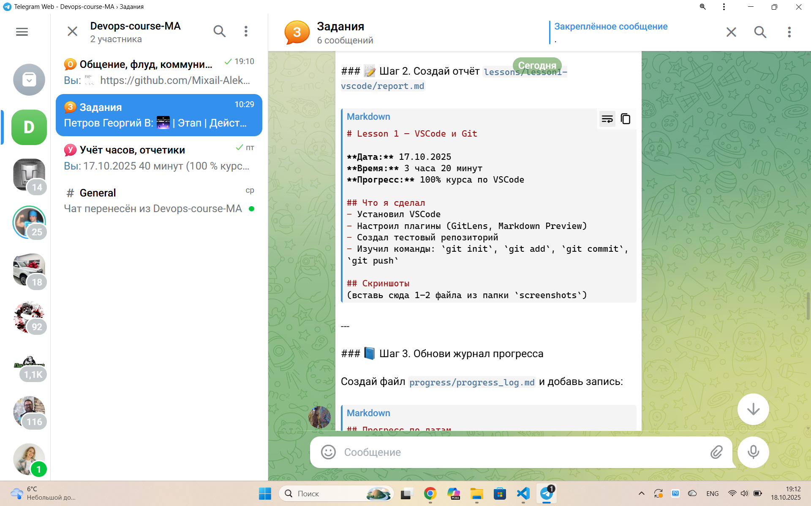

# Lesson 1 — VSCode и Git

**Дата:** 17.10.2025  
**Время:** 3 часа 20 минут  
**Прогресс:** 100% курса по VSCode

## Что я сделал
- Установил VSCode
- Настроил плагины (GitLens, Markdown Preview)
- Создал тестовый репозиторий
- Изучил команды: 'git init','git status', 'git add', 'git commit -m', 'git push', 'git clone', 'git pull', 'git branch', 'git checkout'.
