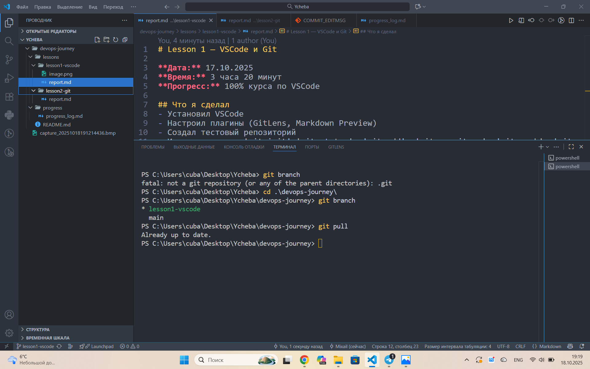

# Lesson 1 — VSCode и Git

**Дата:** 18.10.2025  
**Время:** 1 час  30 минут  
**Прогресс:** 100% курса по VSCode

## Что я сделал
- Установил VSCode
- Настроил плагины (GitLens, Markdown Preview)
- Изучение команд в терминале
		pip install - установка пакетов
		pip uninstall - удаление пакетов 
		pip list - список установленных пакетов
		cls - очистка терминала
		python -m pip list - показывает версию пакетов 
		python -m pip install --upgrade - обновление пакетов
		cd - переход в дерикторию 
		mkdir - создание папок 
		dir - просмотр папок в дериктории
		rm - удаление файла
		pip install pipenv - установка виртуальной среды 
		pip -m venv . - создание контейнера
		pipenv shell - переход в работу в контейнере 

		

