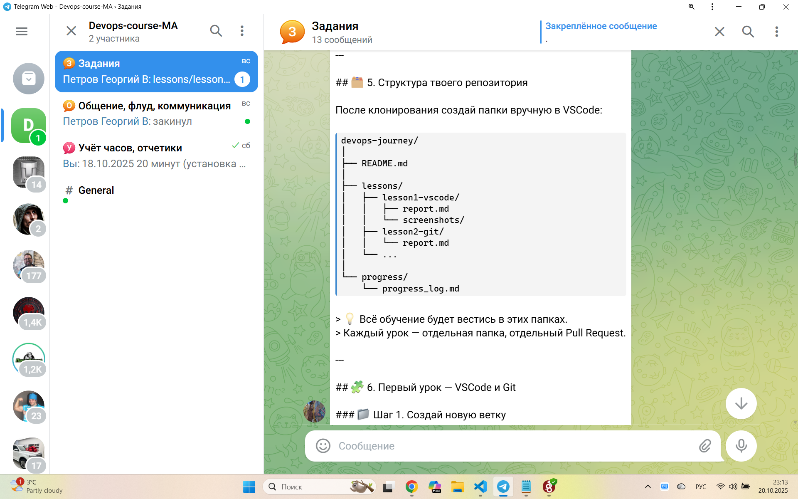
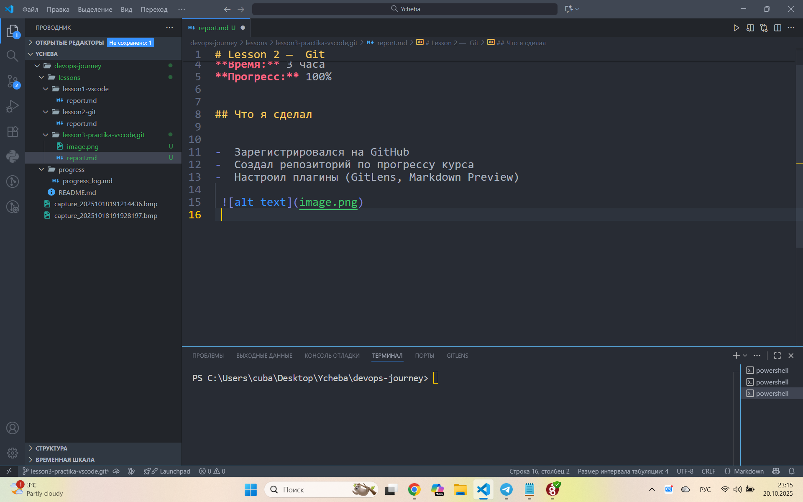

# Lesson 3 —  Practika-vscode,git

**Дата:** 18.10.2025  
**Время:** 3 часа    
**Прогресс:** 100% 

## Что я сделал

-  Зарегистрировался на GitHub
-  Создал репозиторий по прогрессу курса
-  Настроил плагины (GitLens, Markdown Preview)
-  Установка VMware
 
 
 