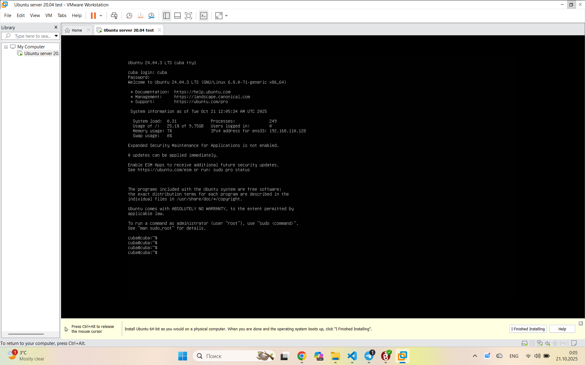
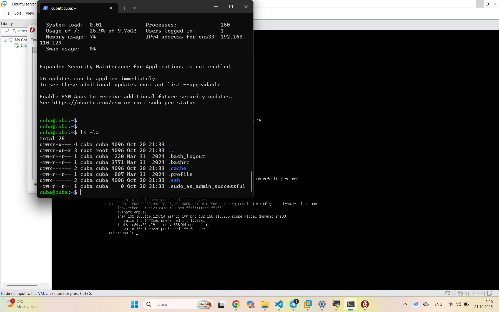
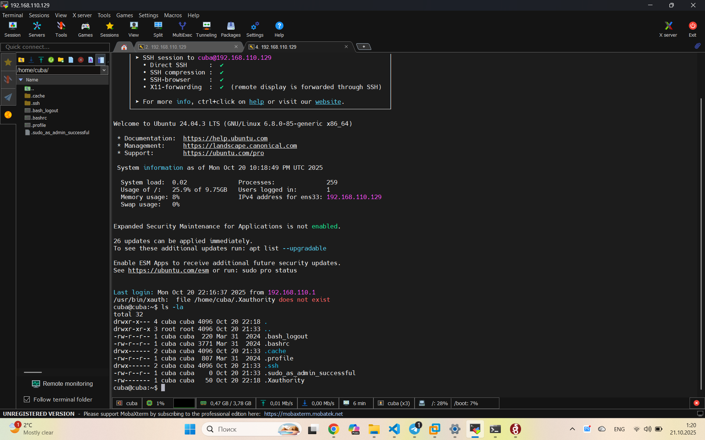
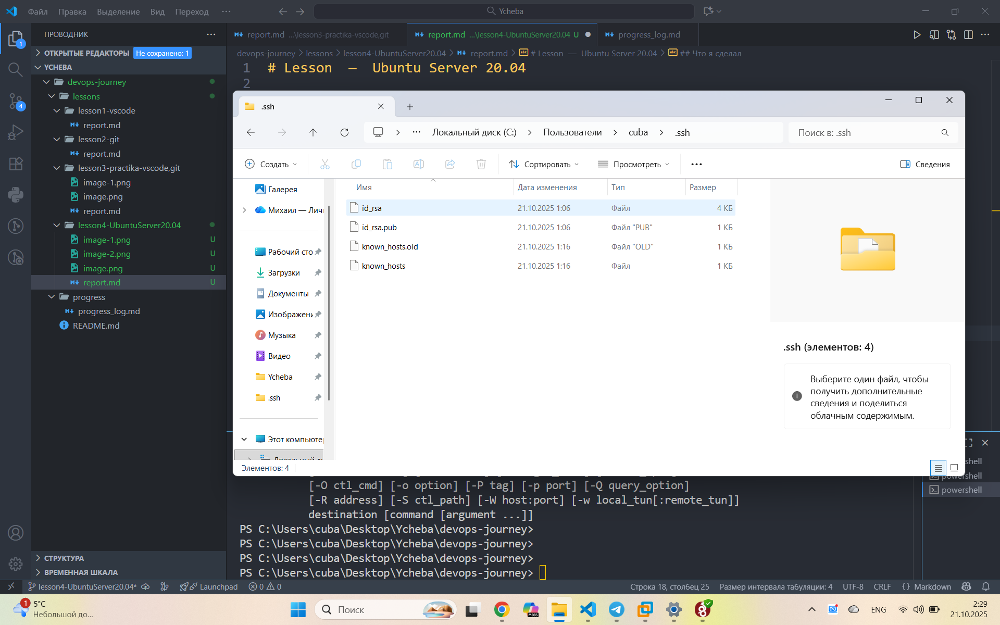

# Lesson4  —  Ubuntu Server 20.04

**Дата:** 20.10.2025  
**Время:** 3 часа 30 минут    
**Прогресс:** 100% 

https://www.youtube.com/watch?v=8H0Gt5YRILc&t=7s
https://www.youtube.com/watch?v=j_puSspUK6Y
https://www.youtube.com/watch?v=wczb8BJEwgk

## Что я сделал

-  Установил Ubuntu Server 20.04 на VMware ()
-  Подключился по SSH ()
-  Подключился через приложение MobaXterm ()
-  Создал SSH-ключ на Windows ()
-  Настроил вход по SSH-ключу
-  НЕПОЛУЧИЛОСЬ НАСТРОИТЬ SSH-демон!!!!!!!!!!!!!!!!
 

 Последовательность команд:

 
	-Узнаем адресс сервера (ip a)
	-В Vscode открываем терминал (ssh cuba@192.168.110.129) вводим login  и pw

	-Vscode  (ssh-keygen -t rsa -b 4096 -C "почта@mail.ru")
	-Vacode (.\.ssh\id_rsa.pub) открываем файл так в vscode и копируем содержимое 
	-Подключаемся через MobaXterm к серверу и создаем папку и файл (mkdir -p ~/.ssh), (nano ~/.ssh/authorized_keys) вставляем туда скопированный ключ из vscode 
	-Выставляем права на сервере (chmod 700 ~/.ssh), (chmod 600 ~/.ssh/authorized_keys)
	-Vscode (ssh cuba@192.168.110.129) готово

	
